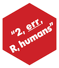

<!-- README.md is generated from README.Rmd. Please edit that file -->

```{r setup, include = FALSE}
knitr::opts_chunk$set(
  collapse = TRUE,
  comment = "#>",
  fig.path = "man/figures/README-",
  out.width = "100%"
)
```

# ssdtools 

[](https://www.tidyverse.org/lifecycle/#maturing)
[](https://travis-ci.com/poissonconsulting/err)
[](https://ci.appveyor.com/project/poissonconsulting/err)
[](https://codecov.io/github/poissonconsulting/err?branch=master)
[](https://opensource.org/licenses/MIT)
[](https://cran.r-project.org/package=err)

## Introduction

> To err is human - Alexander Pope (1711)

`err` is a light-weight R package to produce customizable number and object sensitive error and warning messages.

## Demonstration

### Object Sensitive

The `co` functions produce object sensitive strings.
```{r}
library(err)

fox <- c("The", "quick", "brown", "fox", "jumps", "over", "the", "lazy", "dog")
co(fox)
co(fox[1])
co(fox[0])
co(fox, nlots = 5)
```

### Customizable

The object sensitive strings are fully customized.
```{r}
one <- "darn! the vector %o of length %n has the following value: %c"
none <- "phew! vector %o is empty"
some <- "rats! vector %o has the following %n element%s: %c"
lots <- "really?! the %n elements of vector %o are too numerous to print"

co(fox[0], one = one, none = none, some = some, lots = lots, nlots = 5)
co(fox[1], one = one, none = none, some = some, lots = lots, nlots = 5)
co(fox[1:3], one = one, none = none, some = some, lots = lots, nlots = 5)
co(fox[1:5], one = one, none = none, some = some, lots = lots, nlots = 5)
```

The following `sprintf`-like types can be used in the custom messages:

- `%c`: the object as a comma separated list (producted by a `cc` function)
- `%n`: the length of the object
- `%o`: the name of the object
- `%s`: 's' if n != 1 otherwise ''
- `%r`: 'are' if n != 1 otherwise 'is'

And there are various formatting options
```{r}
co(fox[1:6], conjunction = "or", bracket = "|", oxford = TRUE, ellipsis = 5)
```

### Data Frames

There is also a method for data frames.

```{r}
cat(co(datasets::mtcars, conjunction = "and", oxford = TRUE, ellipsis = 5))
```

### Number Sensitive

The `cn` function produces number sensitive customizable messages

```{r}
cn(0)
cn(1)
cn(2)
cn(100, lots = "there %r %n value%s - this is a lot")
```

### Warning and Error Messages

The `co` and `cn` functions can be combined with the wrappers `msg`, `wrn` and `err` to produce a message, warning and error (without the call as part of the warning/error message).

```{r, error = TRUE}
msg(cn(2))
wrn(cn(2))
err(cn(2))
```

## Installation

To install the latest release version from [CRAN](https://cran.r-project.org)
```
install.packages("err")
```

To install the latest development version from [GitHub](https://github.com/poissonconsulting/err)
```
# install.packages("devtools")
devtools::install_github("poissonconsulting/err")
```

To install the latest development version from the Poisson drat [repository](https://github.com/poissonconsulting/drat)
```
# install.packages("drat")
drat::addRepo("poissonconsulting")
install.packages("err")
```

## Citation

```{r, comment="", echo=FALSE}
citation(package = "err")
```

## Contribution

Please report any [issues](https://github.com/poissonconsulting/err/issues).

[Pull requests](https://github.com/poissonconsulting/err/pulls) are always welcome.

Please note that this project is released with a [Contributor Code of Conduct](CONDUCT.md). 
By participating in this project you agree to abide by its terms.

## Inspiration

[`concatenate`](https://github.com/jamesdunham/concatenate) by [James Dunham](https://github.com/jamesdunham).
