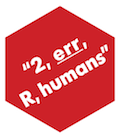

<!-- README.md is generated from README.Rmd. Please edit that file -->


# err 

[](https://www.tidyverse.org/lifecycle/#maturing)
[](https://github.com/poissonconsulting/err/actions)
[](https://codecov.io/github/poissonconsulting/err?branch=master)
[](https://opensource.org/licenses/MIT)
[](https://cran.r-project.org/package=err)


## Introduction

> To err is human - Alexander Pope (1711)

`err` is a light-weight R package to produce customizable number and object sensitive error and warning messages.

## Demonstration

### Object Sensitive

The `co` functions produce object sensitive strings.

```r
library(err)

fox <- c("The", "quick", "brown", "fox", "jumps", "over", "the", "lazy", "dog")
co(fox)
#> [1] "fox has 9 values: 'The', 'quick', 'brown', 'fox', 'jumps', 'over', 'the', 'lazy', 'dog'"
co(fox[1])
#> [1] "fox[1] has 1 value: 'The'"
co(fox[0])
#> [1] "fox[0] has 0 values"
co(fox, nlots = 5)
#> [1] "fox has 9 values: 'The', 'quick', 'brown', ..., 'dog'"
```

### Customizable

The object sensitive strings are fully customized.

```r
one <- "darn! the vector %o of length %n has the following value: %c"
none <- "phew! vector %o is empty"
some <- "rats! vector %o has the following %n element%s: %c"
lots <- "really?! the %n elements of vector %o are too numerous to print"

co(fox[0], one = one, none = none, some = some, lots = lots, nlots = 5)
#> [1] "phew! vector fox[0] is empty"
co(fox[1], one = one, none = none, some = some, lots = lots, nlots = 5)
#> [1] "darn! the vector fox[1] of length 1 has the following value: 'The'"
co(fox[1:3], one = one, none = none, some = some, lots = lots, nlots = 5)
#> [1] "rats! vector fox[1:3] has the following 3 elements: 'The', 'quick', 'brown'"
co(fox[1:5], one = one, none = none, some = some, lots = lots, nlots = 5)
#> [1] "really?! the 5 elements of vector fox[1:5] are too numerous to print"
```

The following `sprintf`-like types can be used in the custom messages:

- `%c`: the object as a comma separated list (produced by a `cc` function)
- `%n`: the length of the object
- `%o`: the name of the object
- `%s`: 's' if n != 1 otherwise ''
- `%r`: 'are' if n != 1 otherwise 'is'

And there are various formatting options

```r
co(fox[1:6], conjunction = "or", bracket = "|", oxford = TRUE, ellipsis = 5)
#> [1] "fox[1:6] has 6 values: |The|, |quick|, |brown|, ..., or |over|"
```

### Data Frames

There is also a method for data frames.


```r
cat(co(datasets::mtcars, conjunction = "and", oxford = TRUE, ellipsis = 5))
#> datasets::mtcars has 11 columns
#> mpg: 21, 21, 22.8, ..., and 21.4
#> cyl: 6, 6, 4, ..., and 4
#> disp: 160, 160, 108, ..., and 121
#> ...
#> and carb: 4, 4, 1, ..., and 2
```

### Number Sensitive

The `cn` function produces number sensitive customizable messages


```r
cn(0)
#> [1] "there are 0 values"
cn(1)
#> [1] "there is 1 value"
cn(2)
#> [1] "there are 2 values"
cn(100, lots = "there %r %n value%s - this is a lot")
#> [1] "there are 100 values - this is a lot"
```

### Warning and Error Messages

The `co` and `cn` functions can be combined with the wrappers `msg`, `wrn` and `err` to produce a message, warning and error (without the call as part of the warning/error message).


```r
msg(cn(2))
#> there are 2 values
wrn(cn(2))
#> Warning: there are 2 values
err(cn(2))
#> Error: there are 2 values
```

## Installation

To install the latest release version from [CRAN](https://cran.r-project.org)
```
install.packages("err")
```

To install the latest development version from [GitHub](https://github.com/poissonconsulting/err)
```
if(!"devtools" %in% installed.packages()[,1]) 
  install.packages("devtools")
devtools::install_github("poissonconsulting/err")
```


## Contribution

Please report any [issues](https://github.com/poissonconsulting/err/issues).

[Pull requests](https://github.com/poissonconsulting/err/pulls) are always welcome.

Please note that this project is released with a [Contributor Code of Conduct](CONDUCT.md). 
By participating in this project you agree to abide by its terms.

## Inspiration

[`concatenate`](https://github.com/jamesdunham/concatenate) by [James Dunham](https://github.com/jamesdunham)
